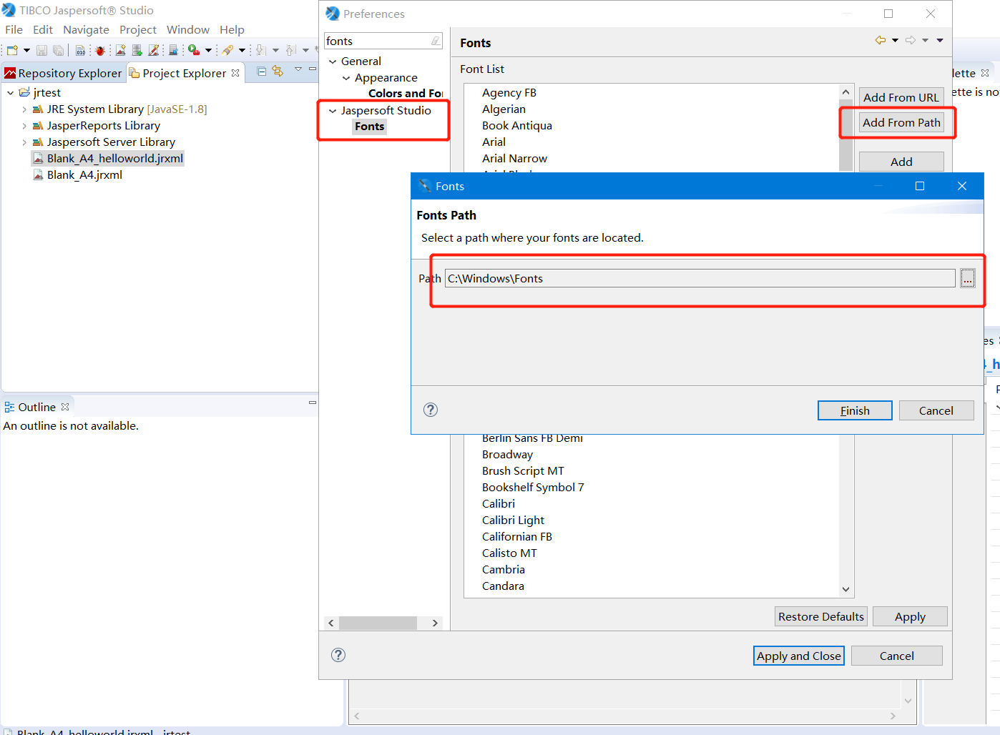

# japserreports-allfonts.jar

## too big

In order to support the Asian fonts (CJK), the jar `japserreports-allfonts.jar` is required.

But the package is too big to be uploaded to github.

And fortunately, it's easy to be generated by `JasperReports Studio`.

## generating steps

1. `Menu` &rightarrow; `Windows` &rightarrow; `Preferences`
1. Load fonts from Windows `Fonts` directory
    
1. Select All Fonts and click `Export` to export all fonts to a jar.
1. Copy the jar to the `lib` dir, and rename it as `jasperreports-allfonts.jar`
1. Done

